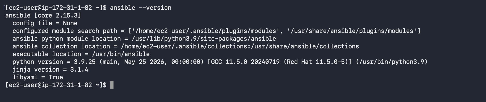
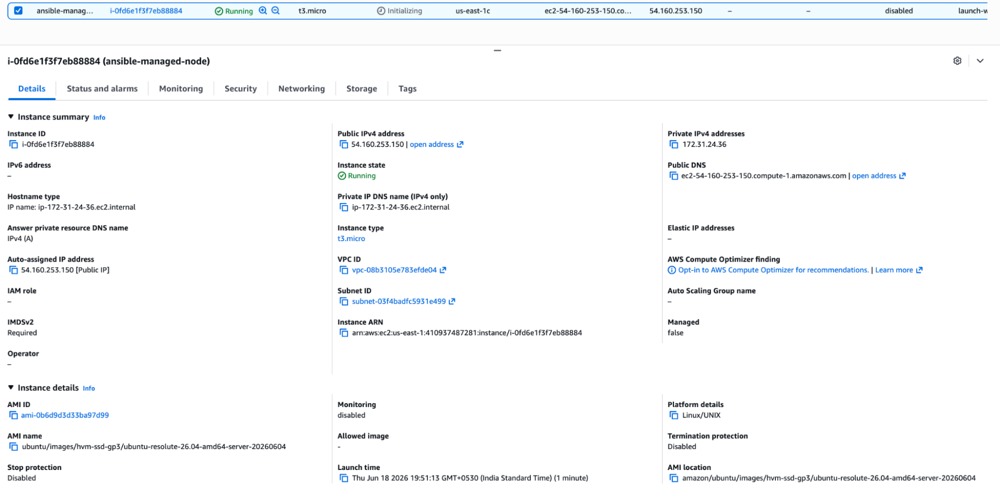
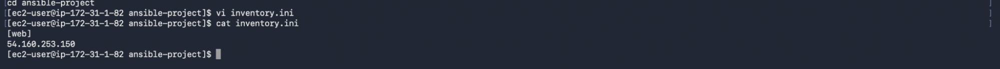
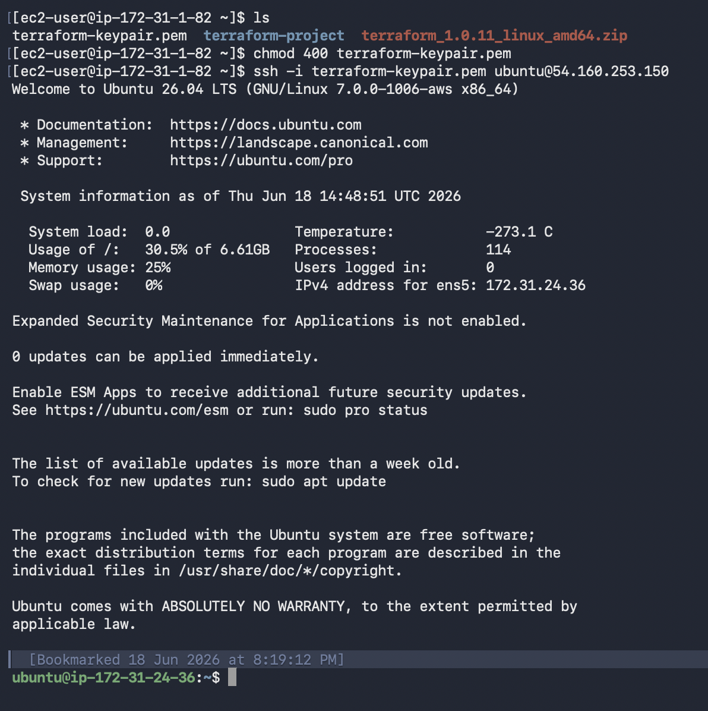
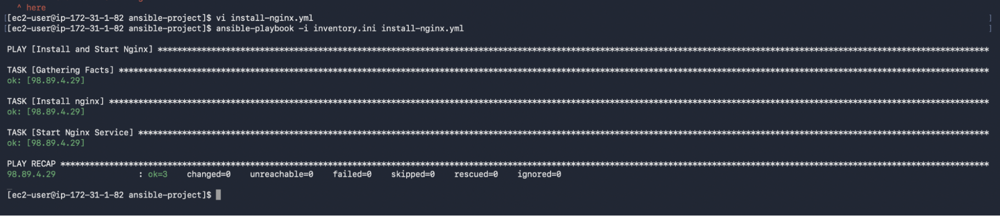
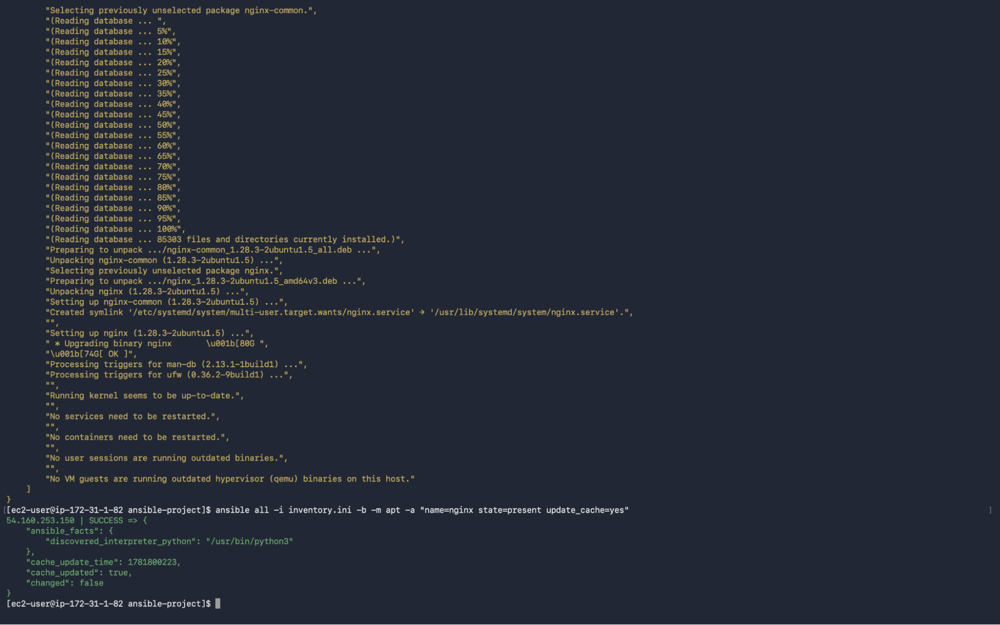
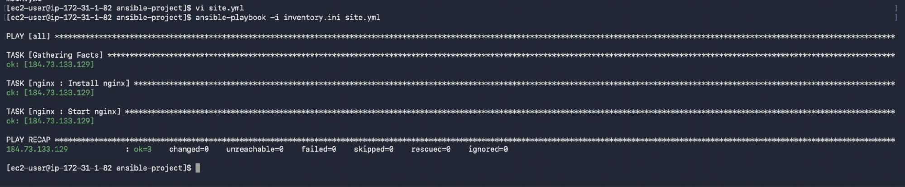

# Ansible Server Automation

## Project Overview

Configured and automated Linux server management using Ansible. This project covers inventory configuration, SSH-based communication, ad-hoc commands, playbook execution, package installation, configuration management, templates, handlers, variables, and role-based automation.

---

## Project Goal

Automate server configuration using Ansible instead of performing repetitive manual administration tasks.

---

## Implementation Journey

### Step 1 - Install Ansible

- Installed Ansible on the control node.
- Verified the installation.

---

### Step 2 - Configure Managed Node

- Configured the managed node.
- Enabled SSH communication between the control node and managed node.

---

### Step 3 - Configure Inventory

- Created the Ansible inventory.
- Added managed node details.

---

### Step 4 - Verify Connectivity

- Verified SSH communication.
- Tested connectivity using Ansible ping.

---

### Step 5 - Execute Playbooks

- Executed Ansible playbooks.
- Automated package installation and configuration tasks.

---

### Step 6 - Deploy Nginx

- Installed and managed the Nginx service.
- Verified successful deployment.

---

### Step 7 - Templates and Roles

- Generated dynamic configuration using Jinja2 templates.
- Organized automation using Ansible Roles.

---

## Challenges Faced

### Challenge 1 - SSH Communication

**Issue**

Initially, communication between the control node and managed node required proper SSH configuration.

**Resolution**

Configured SSH keys and verified connectivity before running playbooks.

**Learning**

Always verify connectivity before automation.

---

### Challenge 2 - Idempotent Execution

**Issue**

Expected every playbook execution to make changes.

**Resolution**

Learned that Ansible only changes the system when required.

**Learning**

Idempotency ensures predictable automation.

---

### Challenge 3 - Organizing Automation

**Issue**

Playbooks become difficult to manage as automation grows.

**Resolution**

Used Roles to organize tasks into reusable components.

**Learning**

Roles improve scalability and maintainability.

---

## Key Learnings

- Automated Linux server administration using Ansible.
- Configured Inventory and SSH connectivity.
- Executed Ad-hoc commands and Playbooks.
- Managed packages and services.
- Used Variables, Templates, and Handlers.
- Organized automation using Roles.
- Understood idempotent configuration management.

---

## Project Outcome

Successfully automated Linux server configuration using Ansible by implementing inventory management, playbooks, templates, handlers, and roles. This project strengthened my understanding of configuration management and repeatable infrastructure automation.

---

## Source Code

The Ansible files used in this project are available in the `source-code` directory.

- inventory
- playbook.yml
- roles/
